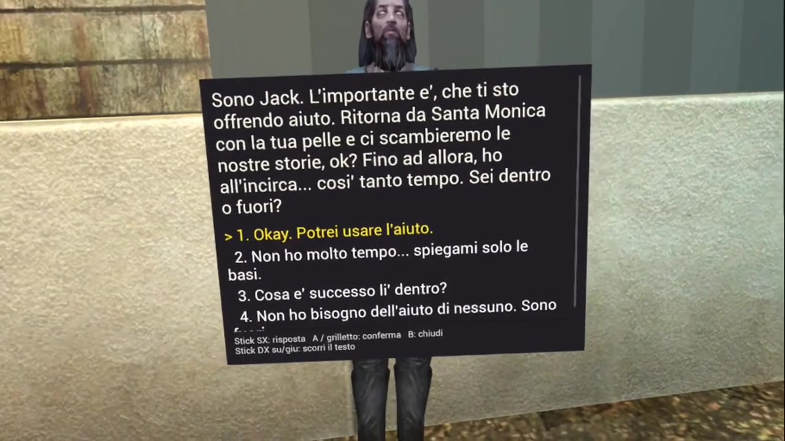

# GhostDLL — VTMB Standalone VR Experiment
**Early standalone VR proof of concept for Meta Quest 3.**

>
> 

https://github.com/user-attachments/assets/b80aafca-f92c-406e-a1ac-4dd45988ffcd


[](GhostDLL_Bloodlines_VR_POC_GitHub_under10MB.mp4)

**[Watch the proof-of-concept video](GhostDLL_Bloodlines_VR_POC_GitHub_under10MB.mp4)**


This is an independent experimental project exploring whether **Vampire: The Masquerade – Bloodlines** can work as a convincing standalone VR experience.

> Early technical prototype.  
> No public build is available yet.

## Proof of concept

<!-- KEEP THE EXISTING GITHUB VIDEO ATTACHMENT BELOW -->

https://github.com/user-attachments/assets/KEEP-YOUR-CURRENT-VIDEO-ID-HERE

The video shows an early internal development build running on Meta Quest 3.

It is not representative of final graphics, UI, performance or gameplay.

---

## Why this project exists

This project started from a simple question:

**Why has Vampire: The Masquerade – Bloodlines received so little attention as a potential standalone VR experience?**

Bloodlines remains a distinctive first-person RPG with an unusual combination of:

- atmospheric environments
- dialogue-heavy gameplay
- memorable characters
- exploration
- ranged and melee combat
- multiple dialogue choices
- different ways of approaching situations

Many of these elements could translate particularly well to VR.

The purpose of this experiment is to see how far that idea can actually be pushed on standalone hardware such as **Meta Quest 3**.

---

## This is a proof of concept

I am an independent enthusiast, not a professional game development studio.

I do **not** currently promise a complete port of the entire game.

One of the main goals of this project is simply to demonstrate that a standalone VR interpretation of Bloodlines is technically interesting and worth exploring.

If this prototype helps attract the attention of experienced VR developers or established teams interested in taking the idea further, I would consider that a success.

---

## Long-term technical direction

The intended public architecture is based on a simple principle:

**Ghost2DLL should provide the VR runtime — not the original game.**

The goal is for a future runtime to work with game data supplied by the user from their own legally obtained installation of Vampire: The Masquerade – Bloodlines.

Conceptually:

```text
Legally owned Bloodlines installation
                |
                v
      user copies game data
         to Meta Quest
                |
                v
        Ghost2DLL runtime
                |
                v
     standalone VR experience
The end user should **not** need:

- Unreal Engine
- Unreal Editor
- Visual Studio
- Android Studio
- compilers
- development SDKs
- asset-conversion utilities

Any required interpretation, validation or preparation of supported game data should eventually be handled directly by the Quest application.

---

## Current development target

The long-term public target is intended to use a **clean Steam installation of Vampire: The Masquerade – Bloodlines** as the reference game-data source.

For now, the focus is on:

- Meta Quest 3
- standalone execution
- stereoscopic VR rendering
- head tracking
- VR locomotion
- controller interaction
- right-hand aiming
- dialogue interaction
- importing and interpreting original game data

Support for unofficial patches, translations and other modifications is **not currently part of the public target** and may be investigated separately in the future.

---

## Independent runtime

The intended Ghost2DLL runtime is a separate implementation.

The project does not aim to distribute, modify or execute the original Windows Bloodlines engine on Meta Quest.

The long-term goal is to create an independent VR runtime capable of interpreting supported game data supplied by the user from their own legally obtained installation.

The original Bloodlines executable and Windows DLL files are not intended to form part of the Ghost2DLL runtime.

---

## What this repository does not contain

This repository does **not** distribute:

- the original game
- original game assets
- maps
- models
- textures
- audio
- original executables
- original DLL files
- Unofficial Patch files
- third-party translations

A legally obtained copy of **Vampire: The Masquerade – Bloodlines** would be required for any future public runtime that depends on original game data.

---

## Project status

**Very early development / technical proof of concept**

Current priorities are:

1. demonstrate the opening/tutorial section in standalone VR
2. establish a clean technical baseline
3. investigate runtime loading and conversion of original game data
4. preserve good Quest 3 performance
5. document the architecture
6. determine whether development can realistically be expanded further

There is currently **no release date** and no guarantee that the complete game will be ported by this project.

---

## Developers and VR teams

I would be very interested in hearing from developers or teams with experience in:

- standalone VR
- Meta Quest development
- Android ARM64
- OpenXR
- legacy game formats
- runtime asset loading
- VR interaction systems
- game-engine reimplementation
- performance optimization on mobile VR hardware

The project is partly intended as a demonstration that **Bloodlines deserves serious consideration as a VR experience**.

Issues and technical discussion are welcome.

---

## Source code and project ownership

The public existence of this repository should not be interpreted as permission to copy, redistribute or incorporate original Ghost2DLL project code into another project.

Unless explicitly stated otherwise, original Ghost2DLL-developed code, tools and documentation remain under the copyright of their respective author.

See [COPYRIGHT.md](COPYRIGHT.md).

The core development source code is not currently being released as open source.

---

## Contributions

For the moment, the most useful contributions are:

- testing feedback
- technical discussion
- bug reports
- information about relevant file formats
- VR development experience
- performance observations

Please read [CONTRIBUTING.md](CONTRIBUTING.md) before submitting code or other material.

---

## Supporting the project

Development is currently carried out independently and in spare time.

Anyone who wishes to support the time and effort involved may do so voluntarily.

Any such contribution is optional and is not intended to provide exclusive access to copyrighted game material, exclusive gameplay content or special rights to the original game.

See [SUPPORT.md](SUPPORT.md).

---

## Disclaimer

This is an **unofficial fan-made technical experiment**.

It is not affiliated with, sponsored by, approved by or endorsed by Activision, Paradox Interactive, Troika Games, White Wolf, Valve, Meta, Epic Games, the Unofficial Patch team or any other rights holder or third-party project mentioned here.

**Vampire: The Masquerade – Bloodlines**, its characters, story, environments, artwork, audio and other original game content remain the property of their respective rights holders.

**Unreal Engine** and related trademarks are the property of Epic Games, Inc.

No ownership of third-party intellectual property is claimed.
